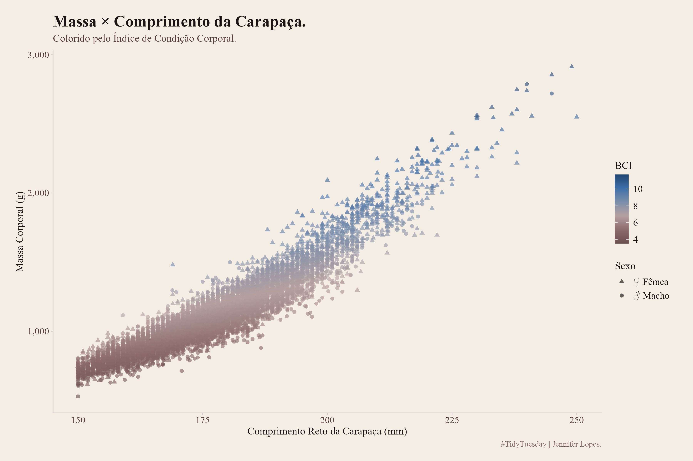
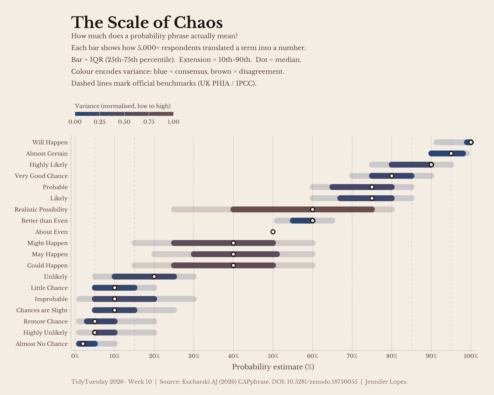
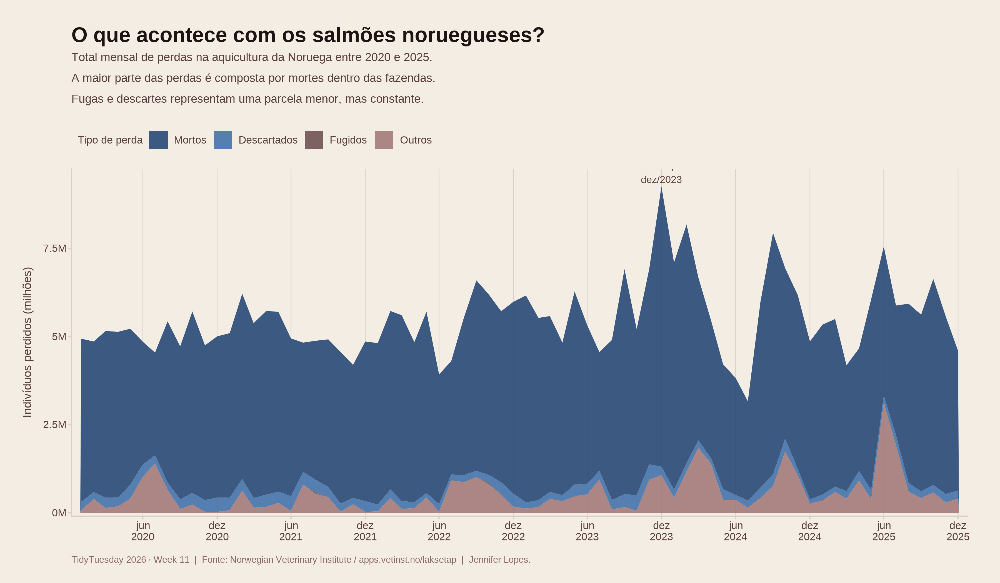

# Minha TidyTuesday

**TidyTuesday** é um projeto semanal de dados sociais organizado pela [Data Science Learning Community](https://dslc.io/). A cada semana, um novo conjunto de dados é publicado para que a comunidade pratique técnicas de análise, visualização e storytelling com dados.

Este repositório reúne minhas contribuições semanais, desenvolvidas em R com `ggplot2`.

## Sobre o projeto

Cada pasta corresponde a uma semana do desafio e contém o script R utilizado para gerar a visualização. O foco está em criar gráficos com identidade visual própria, usando uma paleta de cores consistente ao longo das semanas.

## Tecnologias

-   **Linguagem:** R
-   **Pacotes principais:** `ggplot2`, `dplyr`, `tidyr`, `scales`, `patchwork`

## Acompanhe

-   🐦 [#TidyTuesday](https://twitter.com/hashtag/TidyTuesday)
-   📦 [Repositório oficial do TidyTuesday](https://github.com/rfordatascience/tidytuesday)

## Semanas

### **9° Semana - 2026-03-03 - Golem Grad Tortoise Data**

Acesse já o [**`repositório`**](https://github.com/rfordatascience/tidytuesday/tree/main/data/2026).

### **10° Semana - 2026-03-10 - How likely is 'likely'?**

Acesse já o [**`repositório`**](https://github.com/rfordatascience/tidytuesday/tree/main/data/2026).

### **11° Semana - 2026-03-17 -** Salmonid Mortality Data

Acesse já o [**`repositório`**](https://github.com/rfordatascience/tidytuesday/blob/main/data/2026/2026-03-17/readme.md).

